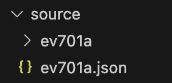
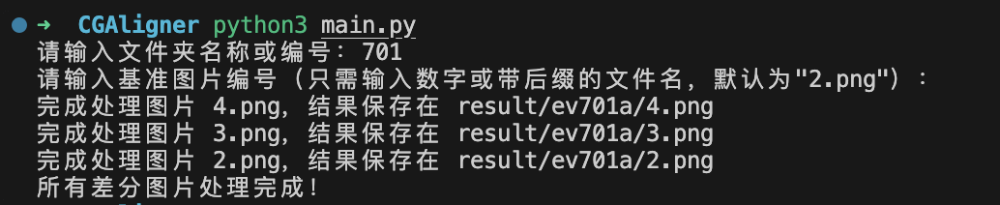
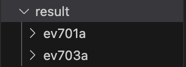
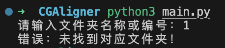
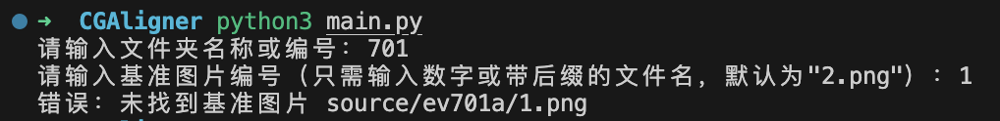

# CGAligner
## 功能介绍
在对 galgame 的类似 `ev701a.pimg` 进行解包后，会得到 `ev701a/` 目录、`ev701a.json` json 文件。本程序使用 Python 实现，旨在通过读取 json 文件中的坐标信息，将 CG 背景与差分文件进行合成。  
（本程序基于对 *天使☆騒々 RE-BOOT!* 的解包实现。柚子社的应该区别不大，别的社的 gal 我就不知道了。）

## 使用方法
### 安装依赖
```bash
pip install -r requirements.txt
```
但其实说白了只有一个依赖库，因此直接安装也可。
```bash
pip install pillow
```

### 创建 source 目录并加入 json 文件与相应文件夹
在 `main.py` 的目录下，创建 `source` 目录，并把需要合成的诸如 `ev701a` 目录、`ev701a.json` 文件放入 `source` 目录下。  


### 运行程序
在命令行中输入
```bash
python3 main.py
```
随后根据提示，输入目录名和背景文件名

* 目录名可以输全称，也可以直接输入 `701` 这样的编号，会自动补上前缀 `ev` 和后缀 `a`；
* CG 背景的文件名默认为 `2.png`，共三种输入方法：
  1. 直接回车，采用默认值 `2.png`
  2. 输入 `2`，会补全为 `2.png`
  3. 完整输入 `2.png`

示例：  


### 运行结果
在 `main.py` 的目录下，会生成目录 `result/` ，结果存在与输入同名的目录下。

示例：  


### 错误示例
#### 未找到相应文件夹

1. 确认一下目录名是否有正确输入
2. 确认是否有将该目录置于 `source/` 下

#### 未找到基准图片

1. 确认一下是否有正确输入基准图片的名字（或者说 2.png 是否为正确的 CG 背景图片）
2. 确认是否有在 source/{folder_name}/ 目录下，其中 `{folder_name}` 为在前一步中输入的目录名

## 一些问题
* 说不清版本之类的信息
* 如果同一个目录中有多个能当作背景图片的 base 存在，可能会很奇怪（没试过）
* 个人在使用别的 CG 合成时，遇到过处理完的图片中不含原本的背景的情况。故添加了 base 图片的储存。
* 似乎现在有处理完的图片比原本小的情况。正在检查原因。
  * 当然感觉很可能检查不出原因。不介意的话就这样用吧（）
  * 如果有大佬知道原因请务必告诉我拜托拜托
